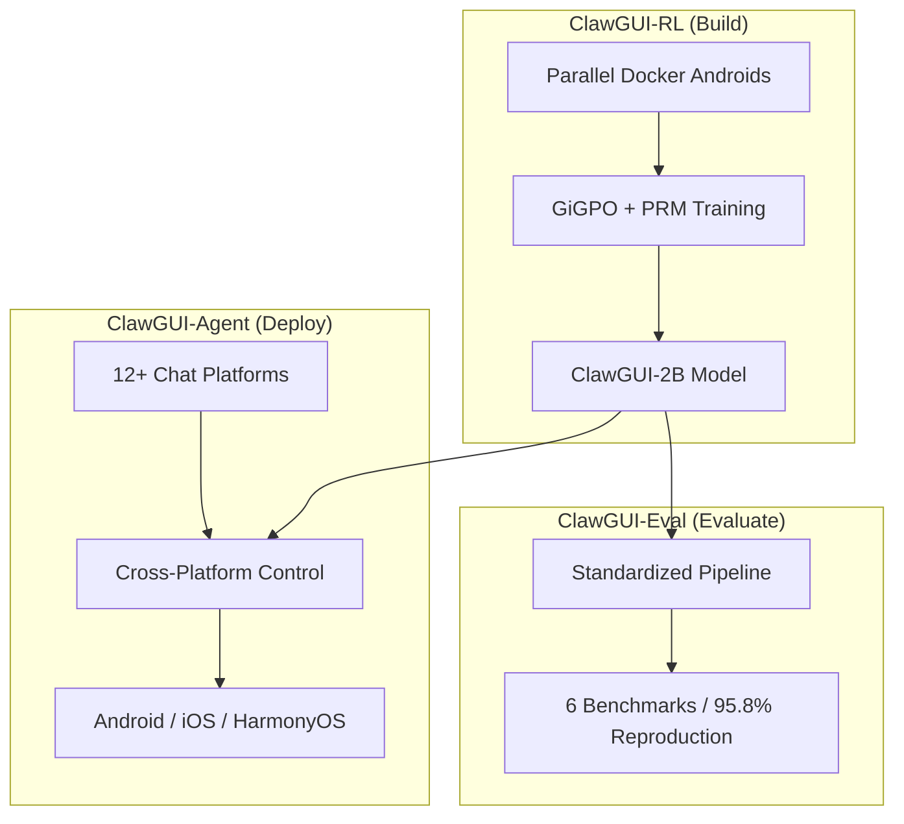

# ClawGUI: 浙江大学重磅开源的 GUI Agent 全栈研究框架

> 作者：Damon Li | 更新日期：2026年6月12日

## 1. 概述

**ClawGUI** 是由浙江大学 REAL 实验室（ZJU-REAL）于 2026 年 4 月发布的 GUI Agent 领域首个全栈开源框架。该框架的推出旨在终结 GUI Agent 研究中长期存在的“基础设施匮乏”和“评估结果难以复现”（即所谓的“数据打架”）时代。ClawGUI 实现了从在线强化学习（RL）训练、标准化评估到真实设备部署的完整生命周期闭环，为研究者提供了一个统一且高性能的基准平台 [1]。

## 2. 核心架构：三位一体的全栈方案

ClawGUI 的设计理念是将 GUI Agent 开发中三个紧密耦合的环节——**构建（Build）**、**评估（Evaluate）**和**部署（Deploy）**——整合进一个统一的管道中。

### 2.1 ClawGUI-RL：可扩展的在线强化学习
ClawGUI-RL 解决了 GUI 智能体训练中环境获取难、采样效率低的痛点。它支持基于 Docker 的并行 Android 模拟器环境，能够实现大规模的在线数据采集与策略优化。其核心技术 **GiGPO + PRM** 引入了细粒度的步骤级奖励机制，使得模型在复杂的长视野任务中能够获得更准确的反馈，显著提升了训练的稳定性和最终性能。

### 2.2 ClawGUI-Eval：终结“数据打架”的标准化评估
针对不同研究者评估脚本不统一导致的复现性差问题，ClawGUI-Eval 提供了一套严谨的标准化评估模块。该模块覆盖了 ScreenSpot-Pro、OSWorld-G 等 6 个主流基准，并针对 11+ 种主流模型实现了高达 **95.8%** 的官方结果复现率。这种高度的一致性为行业建立了一个公认的“度量衡”。

### 2.3 ClawGUI-Agent：从实验室走向真实世界
ClawGUI-Agent 提供了跨平台的部署能力，支持 Android、HarmonyOS 和 iOS 设备。用户可以通过微信、Slack 等 12+ 种主流聊天平台，直接以自然语言控制真实手机完成复杂任务。此外，它还支持“一键评测”功能，只需一句指令即可在真实设备上跑完完整的 Benchmark 流程。

## 3. 性能突破：2B 模型的高效逆袭

ClawGUI 最受关注的成果之一是其训练出的 **ClawGUI-2B** 模型。在 MobileWorld 纯图形界面（GUI-Only）测试中，该模型取得了 **17.1%** 的成功率，相比同规模的基线模型（如 MAI-UI-2B 的 11.1%）提升了 **54%** [2]。

| 模型 | 参数规模 | MobileWorld SR (GUI-Only) | 性能提升 |
| :--- | :--- | :--- | :--- |
| **ClawGUI-2B** | 2B | **17.1%** | **+54%** |
| MAI-UI-2B (Baseline) | 2B | 11.1% | - |

这种“小模型吊打大模型”的现象，源于 ClawGUI 针对 GUI 交互任务进行的端到端强化学习优化。通过精准的 Grounding 训练和步骤级奖励引导，2B 规模的模型在特定 GUI 任务上的执行效率和准确度甚至能够挑战未经过针对性优化的 72B 级通用大模型。

## 4. 技术架构图示

以下是 ClawGUI 的全栈架构示意图，展示了其模块间的协同工作流程：

## 5. 代码与资源

- **官方主页**: [ClawGUI Project Page](https://zju-real.github.io/ClawGUI-Page/)
- **GitHub 仓库**: [ZJU-REAL/ClawGUI](https://github.com/ZJU-REAL/ClawGUI)
- **模型权重**: [ClawGUI-2B on HuggingFace](https://huggingface.co/SugarVapeur/OpenGUI-2B)
- **技术报告**: [arXiv:2604.11784](https://arxiv.org/abs/2604.11784)

## 6. 总结与展望

ClawGUI 的开源不仅提供了一个强大的工具集，更重要的是它倡导了一种标准化、可复现的研究范式。随着其路线图中对多智能体协作和更复杂环境支持的逐步实现，ClawGUI 有望成为 GUI Agent 领域的“基础设施级”框架，推动该领域从学术探索向大规模工业应用加速迈进。

## 7. 参考资料

[1] [ClawGUI: A Unified Framework for Training, Evaluating, and Deploying GUI Agents](https://arxiv.org/abs/2604.11784)
[2] [ClawGUI Official Results and Performance Metrics](https://zju-real.github.io/ClawGUI-Page/#results)
