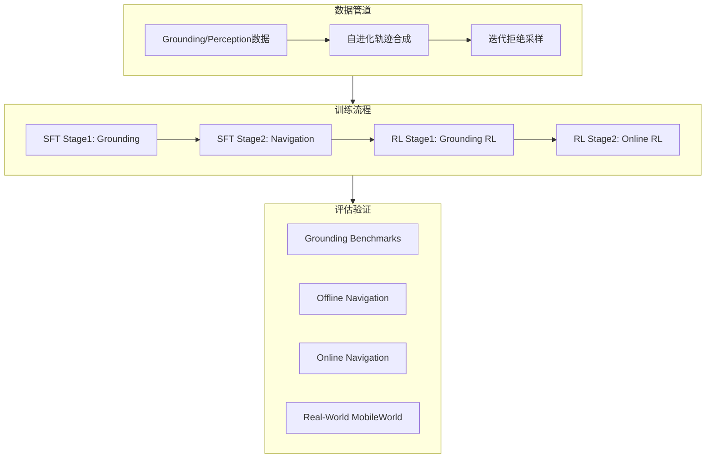
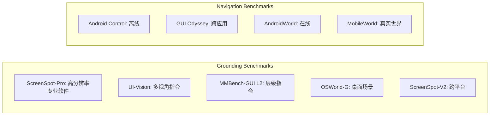

# MAI-UI 技术深度解析：从数据管道到训练验证的全流程实现

> 作者: Damon Li  
> 更新日期: 2026年1月  
> 论文: MAI-UI Technical Report: Real-World Centric Foundation GUI Agents (2025.12)  
> 机构: 阿里通义实验室

GUI Agent 是下一代人机交互的核心技术之一。MAI-UI 是通义实验室发布的面向真实世界的 GUI 智能体系列，覆盖 2B/8B/32B/235B 全尺寸模型，在 ScreenSpot-Pro、AndroidWorld、MobileWorld 等主流 benchmark 上刷新 SOTA。本文聚焦其技术实现，从数据管道、训练流程到评估验证，拆解 MAI-UI 如何构建一个可落地的 GUI Agent。

## 一、问题定义与系统总览

### 1.1 任务形式化

MAI-UI 覆盖两类核心任务：

**Grounding Task**: 给定截图和自然语言指令 $\mathcal{I}$，模型输出坐标点 $\mathcal{P} = (x, y)$ 定位目标 UI 元素。

**Navigation Task**: 建模为 POMDP $(S, \mathcal{O}, \mathcal{A}, \mathcal{T})$，每步根据当前截图 $o_t$ 和历史 $h_t$ 预测动作 $a_t = \pi(\mathcal{I}, o_t, h_t)$。

### 1.2 系统架构



MAI-UI 的核心创新在于三个方面：
1. **自进化数据管线**：扩展传统导航数据，融入用户交互和 MCP 工具调用
2. **SFT + Online RL 训练范式**：通过大规模并行 GUI 环境实现在线强化学习
3. **混合验证机制**：规则验证 + MLLM-as-Judge 的可扩展评估方案
## 二、数据管道：从 Grounding 到自进化轨迹

### 2.1 Grounding/Perception 数据生成


*图：Grounding 和 Perception 数据管道总览*

**数据采集**：
- 开源数据集（JEDI、OS-Atlas）
- 容器化虚拟环境中 MLLM 引导探索
- 使用 a11y tree 或 OmniParser V2 精确定位 UI 元素

**Perception 数据生成**：随机选取 1-3 个 UI 元素，让 MLLM 生成多样化任务（QA、captioning、状态预测），增强模型对界面的语义、关系、布局理解。

**Grounding 数据生成**：遵循 UI-Ins 的 Instruction-as-Reasoning 范式，从四个视角生成指令：

| 视角 | 描述 | 示例 |
|-----|------|------|
| Appearance | 外观特征 | "点击蓝色的搜索按钮" |
| Function | 功能描述 | "点击用于提交表单的按钮" |
| Location | 位置关系 | "点击页面右上角的图标" |
| Intent | 用户意图 | "点击以开始搜索" |

这种多视角设计的关键洞察：开源 Grounding 数据集约 23.3% 存在质量问题，指令多样性和正确性对模型性能至关重要。

### 2.2 自进化轨迹数据管线


*图：自进化数据管线总览，包含任务生成、轨迹合成、迭代拒绝采样三阶段*

**Stage 1: Navigation Task Generation**

任务来源包括：
- APP 使用手册解析
- 专家人工设计
- 开源数据集筛选（按复杂度和可达性过滤）

**Stage 2: Trajectory Synthesis**

两条并行管线生成轨迹：

```python
# 种子任务扩展
def expand_seed_tasks(seed_tasks):
    # L1: 参数调整（日期、阈值、排序条件）
    # L2: 核心对象替换（同场景、同应用）
    return expanded_tasks

# 轨迹生成
trajectories = []
for task in expanded_tasks:
    # 人工标注：Annotator 在 Android 模拟器上执行
    human_traj = human_annotation(task)
    # 模型合成：多个 GUI Agent 自动生成
    model_traj = agent_rollout(task)
    trajectories.extend([human_traj, model_traj])
```

**质量控制的关键：细粒度正确性判断**

失败轨迹中往往存在大量正确的前缀，直接丢弃造成数据浪费。MAI-UI 采用 MLLM-as-Judge 进行细粒度评估：

1. **整体判断**：优先视觉证据（截图）而非文本声明
2. **错误轨迹复用**：识别首次偏差前的最长正确前缀，保留部分成功的子轨迹

**Stage 3: Iterative Rejection Sampling**

```python
# 迭代自进化循环
for t in range(num_iterations):
    # 用当前模型 rollout 新轨迹
    D_RS = {Rollout(M[t], i) for i in I_expansion}
    D_RS = filter_by_correctness(D_RS)  # 细粒度判断过滤
    
    # 混合新轨迹和合成轨迹
    D_new = D_RS | D_synthesis
    
    # 训练下一版本模型
    M[t+1] = fine_tune(M[t], D_new)
```

核心思想：拒绝采样数据帮助缩小 pass@1 和 pass@N 的差距，新轨迹持续提升 pass@N 上限。

### 2.3 Agent-User 交互与 MCP 工具数据

**Agent-User 交互数据构建**：
- 任务设计时故意省略关键信息
- 到达需要缺失信息的步骤时，触发 `ask_user` 动作
- 查询路由到基于 LLM 的合成用户 Agent（持有隐藏上下文）
- 记录查询-响应对，继续轨迹

**MCP 工具数据构建**：
- 设计需要外部工具（高德地图、GitHub API）的任务
- 轨迹中记录工具 schema、参数、返回结果
- 保留正确展示 MCP 工具选择的轨迹
## 三、训练流程：SFT + Online RL

### 3.1 训练阶段概览

| 阶段 | 目标 | 数据 |
|-----|------|------|
| SFT Stage 1 | Grounding 能力 | Perception + Grounding 数据 |
| SFT Stage 2 | Navigation 能力 | 轨迹数据 + 少量 Grounding 数据 |
| RL Stage 1 | Grounding 强化 | GRPO + Point-in-Box Reward |
| RL Stage 2 | Navigation 强化 | Online RL + 动态环境 |

### 3.2 Grounding RL 训练

**算法**：遵循 UI-Ins 的 Instruction-as-Reasoning 范式：
1. SFT 阶段注入多视角指令作为显式推理路径
2. RL 阶段使用 GRPO 鼓励模型动态选择合适的推理视角

**Reward 设计**：

```python
# 格式奖励
R_format = 1 if valid_format(response) else 0

# Point-in-Box 奖励
def point_in_box_reward(pred_x, pred_y, bbox):
    x_l, y_l, x_r, y_r = bbox
    if x_l <= pred_x <= x_r and y_l <= pred_y <= y_r:
        return 1
    return 0

R_total = R_format + R_acc
```

**Zoom-In 策略**：推理时可选的两阶段定位
1. 第一轮预测粗坐标
2. 以该点为中心裁剪 50% 区域，resize 后再次预测

### 3.3 Online RL：大规模并行 GUI 环境


*图：Agentic RL 框架总览，交替进行 rollout 和 training 阶段*

**可扩展 GUI 环境设计**：

GUI 环境的核心挑战是有状态性和资源消耗。MAI-UI 采用容器化方案：

```yaml
# Docker 镜像内容
- Rooted Android Virtual Device (AVD)
- 自托管后端服务
- REST API Server（reset/step/get_observation/evaluate/close）
```

关键特性：
- **一致性**：统一容器化消除外部依赖
- **通用性**：集成 35+ 应用（Mattermost、Mastodon、Mall4Uni 等）
- **RL-native**：AVD 快照机制实现可复现的任务初始化

**环境管理器**：协调跨多台物理机的容器实例
- 容器复用：rollout 完成后 reset 而非销毁
- 统一 REST API 透明访问分布式资源
- 故障检测与自动恢复

实测：10 台阿里云 ECS (ecs.ebmg5s.24xlarge) 支持 512 个并行环境。

**长程 RL 的系统优化**：


*图：MobileAgentLoop 中的详细 rollout 流程*

1. **异步 Rollout**：
   - Agent Loop 异步调用推理服务器
   - Session 管理支持无缝 failover
   - 服务端负载均衡 + prefetching

2. **混合并行训练**：
   - 基于 verl 框架
   - Megatron 混合并行 (TP+PP+CP)
   - 支持百万 token 级别轨迹的端到端训练
   - 图像 resize 到 720p（vs 1080p 速度提升 50.1%，性能持平）

**任务课程设计**：

根据当前策略的 pass@K 成功率动态分层：

| 难度级别 | 成功率范围 | 作用 |
|---------|----------|------|
| Frontier | 0-25% | 推动能力边界 |
| Exploration | 25-50% | 驱动技能发展 |
| Near-mastery | 50-75% | 接近熟练 |
| Exploitation | 75-100% | 巩固已学行为 |

训练早期强调简单任务建立基础，随着成功率提升逐渐转向挑战性任务。

**GRPO 定制化**：

```python
# 目标函数
J_GRPO = E[
    1/sum(|o_c|) * sum(
        min(r_i,t * A_hat_i,t, 
            clip(r_i,t, 1-eps_low, 1+eps_high) * A_hat_i,t)
    )
]

# 关键配置
group_size = 16
eps_low = 0.2  # 标准下界
eps_high = 0.3  # 更大的上界鼓励探索
```

**Reward 设计**：
- 任务完成奖励（规则验证 or MLLM-as-Judge）
- 重复动作惩罚（单个重复到 3-5 动作的循环模式）

**Experience Replay**：维护成功轨迹缓冲区，当 rollout group 无成功时从缓冲区采样，每任务保留最新 8 条轨迹保持近在策略学习。
## 四、评估验证：从 Benchmark 到真实世界

### 4.1 Benchmark 体系



### 4.2 混合验证器设计

MAI-UI 的验证器达到 83% 人工标注一致率：

| 任务类型 | 验证方式 |
|---------|---------|
| 确定性任务（明确成功标准） | 规则验证 + AVD root 权限状态检查 |
| 复杂任务（规则难以穷举） | MLLM-as-Judge 评估轨迹 |

### 4.3 核心实验结果

**Online RL 收益**：

| 模型 | SFT | +RL | 提升 |
|-----|-----|-----|------|
| MAI-UI-2B | 45.1% | 49.1% | +4.0 |
| MAI-UI-8B | 64.7% | 70.7% | +6.0 |
| MAI-UI-32B | 69.8% | 73.3% | +3.5 |

**环境并行度影响**：32 → 512 并行环境带来 +5.2 点提升
**步数预算影响**：15 → 50 步带来 +4.3 点提升


*图：(a) 训练集 reward 趋势 (b) 性能随环境数量的 scaling*

**鲁棒性增强案例**：


*图：MAI-UI 对意外权限弹窗和 pop-up 的鲁棒处理*

Online RL 训练的核心价值：暴露静态离线训练难以覆盖的边缘场景（权限弹窗、意外 pop-up、动作失败恢复），显著提升真实世界部署的鲁棒性。
## 五、关键工程洞察

### 5.1 坐标系统设计

MAI-UI 使用 999 缩放因子的归一化坐标：

```python
SCALE_FACTOR = 999

# 模型输出 [0, 999] 整数坐标
# 内部处理 [0, 1] 归一化坐标
# 最终执行时根据屏幕分辨率计算实际像素

# 模型输出 -> 归一化
point_x = model_x / SCALE_FACTOR  # 500 -> 0.5005

# 归一化 -> 模型输出（历史记录）
model_x = int(point_x * SCALE_FACTOR)  # 0.5 -> 499
```

### 5.2 统一输出格式

```xml
<thinking>
I need to click the search button to proceed.
</thinking>
<tool_call>
{"name": "mobile_use", "arguments": {"action": "click", "coordinate": [500, 300]}}
</tool_call>
```

这种格式的优势：
- 思维过程可解释、可审计
- JSON 格式易于解析和执行
- 支持 `ask_user`、`mcp_call` 等扩展动作

### 5.3 SFT + RL 的稳定性技巧

SFT 阶段使用 Instruction-as-Reasoning 注入多视角推理能力，关键作用：
1. **缓解 RL 阶段的策略崩溃**：纯坐标监督的 SFT + RL 容易崩溃
2. **增强探索行为**：多视角推理提供多样化的 exploration 路径
3. **涌现能力**：模型学会动态选择视角，甚至生成训练视角之外的新分析角度
## 六、总结

MAI-UI 的技术贡献可归纳为：

1. **数据管道创新**：自进化轨迹合成 + 细粒度正确性判断，最大化数据利用效率
2. **可扩展 RL 基础设施**：容器化 GUI 环境 + 异步 rollout + 混合并行训练，支撑 512 环境并行
3. **实用验证机制**：规则验证 + MLLM-as-Judge 混合方案，83% 人工一致率

这套方法论不仅适用于 GUI Agent，对其他需要环境交互的 Agent 系统（如机器人操作、网页自动化）同样具有借鉴价值。
## 参考文献

1. MAI-UI Technical Report: Real-World Centric Foundation GUI Agents, arXiv:2512.22047
2. UI-Ins: Enhancing GUI Grounding with Multi-Perspective Instruction-as-Reasoning, arXiv:2510.20286
3. MobileWorld: Benchmarking Autonomous Mobile Agents, arXiv:2512.19432
4. verl: A Flexible and Efficient RLHF Framework, arXiv:2409.19256
