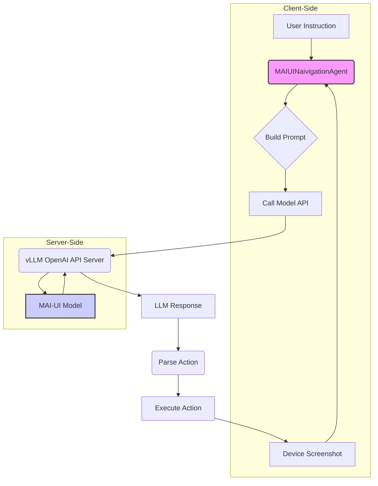

# MAI-UI 工程化部署全流程指南

> **作者**: Damon Li  
> **更新日期**: 2026年1月6日

本指南详细介绍如何对 MAI-UI 模型进行工程化部署，覆盖从环境准备、模型下载、服务启动到客户端集成的完整流程。

## 1. 部署架构概览

MAI-UI 的部署架构分为两部分：**模型服务**和**客户端**。

-   **模型服务**: 负责托管 MAI-UI 模型（如 MAI-UI-8B），提供一个与 OpenAI 兼容的 API 接口。这通常通过 `vllm.entrypoints.openai.api_server` 来实现，它利用 vLLM 库进行高效的模型推理。
-   **客户端**: 即 `MAIUINaivigationAgent` 的实例，它负责处理用户指令、管理多模态输入（截图和历史）、调用模型服务 API，并解析返回的动作。



## 2. 环境准备

在部署之前，需要确保满足以下软硬件要求。

-   **硬件**: 推荐使用配备 NVIDIA GPU 的服务器，至少需要 24GB 显存以流畅运行 8B 模型。
-   **操作系统**: Linux (推荐 Ubuntu 20.04 或更高版本)
-   **Python 版本**: 3.9 或更高版本
-   **核心依赖**: `torch`, `vllm`, `transformers`, `openai`

### 2.1 安装依赖

建议在虚拟环境中安装所有依赖项。

```bash
# 创建并激活虚拟环境
python3 -m venv mai-ui-env
source mai-ui-env/bin/activate

# 安装核心库
pip install torch torchvision torchaudio
pip install vllm==0.5.1
pip install openai
pip install transformers
pip install pillow jinja2
```

**注意**: `vllm` 的版本可能需要根据您的 CUDA 版本进行调整。请参考 [vLLM 官方文档](https://docs.vllm.ai/en/latest/getting_started/installation.html) 获取与您的环境匹配的安装命令。

## 3. 模型下载

MAI-UI 的模型托管在 HuggingFace 上。您需要先下载模型权重到本地。

```bash
# 安装 git-lfs
sudo apt-get install git-lfs
git lfs install

# 克隆 MAI-UI-8B 模型仓库
git clone https://huggingface.co/Tongyi-MAI/MAI-UI-8B /path/to/models/MAI-UI-8B
```

将 `/path/to/models/MAI-UI-8B` 替换为您希望存放模型的实际路径。

## 4. 启动模型服务

使用 `vllm` 提供的 OpenAI 兼容 API 服务器来启动模型服务。

```bash
python3 -m vllm.entrypoints.openai.api_server \
    --model /path/to/models/MAI-UI-8B \
    --trust-remote-code \
    --port 8000 \
    --host 0.0.0.0 \
    --tensor-parallel-size 1
```

-   `--model`: 指向您下载的模型权重的路径。
-   `--trust-remote-code`: 必须添加此项，因为 MAI-UI 模型包含自定义代码。
-   `--port`: 指定 API 服务监听的端口。
-   `--host`: 允许从任何 IP 地址访问服务。
-   `--tensor-parallel-size`: 如果您有多张 GPU，可以设置此值以启用张量并行，加速推理。

服务启动成功后，您将在终端看到类似以下的输出：

```
INFO:     Uvicorn running on http://0.0.0.0:8000 (Press CTRL+C to quit)
```

此时，模型服务已准备就绪，可以接收来自客户端的请求。

## 5. 客户端集成

客户端的核心是 `MAIUINaivigationAgent` 类。以下是如何在您的代码中实例化和使用它。

### 5.1 实例化 Agent

```python
from mai_naivigation_agent import MAIUINaivigationAgent

# 模型服务的地址和模型名称
LLM_BASE_URL = "http://localhost:8000/v1"
MODEL_NAME = "/path/to/models/MAI-UI-8B"

# 运行时配置
runtime_conf = {
    "history_n": 3,       # 使用最近3张历史截图
    "temperature": 0.0,   # 确定性输出
    "max_tokens": 2048,   # 最大生成 token 数
}

# 实例化 Agent
agent = MAIUINaivigationAgent(
    llm_base_url=LLM_BASE_URL,
    model_name=MODEL_NAME,
    runtime_conf=runtime_conf
)
```

### 5.2 调用 Agent 进行预测

要让 Agent 执行一步操作，您需要调用其 `predict` 方法，并传入当前的**指令**和**观察（observation）**。

```python
from PIL import Image

# 用户的指令
instruction = "Open the camera and take a photo."

# 当前的观察，至少需要包含一张屏幕截图
obs = {
    "screenshot": Image.open("path/to/current_screenshot.png")
}

# 调用 predict 方法
prediction_text, action_dict = agent.predict(instruction, obs)

# 打印结果
print("--- Model Prediction ---")
print(prediction_text)
print("--- Parsed Action ---")
print(action_dict)
```

-   `prediction_text`: 模型返回的原始文本，包含 `<thinking>` 和 `<tool_call>`。
-   `action_dict`: 解析后的动作 JSON 对象，可以直接用于执行。

### 5.3 完整的交互循环

一个完整的交互循环如下：

1.  获取用户指令。
2.  进入循环：
    a.  捕获当前设备屏幕截图。
    b.  将指令和截图打包成 `obs`。
    c.  调用 `agent.predict(instruction, obs)` 获取下一步动作。
    d.  根据返回的 `action_dict` 在设备上执行相应操作（如点击、滑动等）。
    e.  如果动作为 `terminate`，则退出循环。
    f.  等待一小段时间，然后继续下一次循环。

## 6. 端云协同部署

MAI-UI 的一大亮点是其端云协同能力。虽然开源代码中未直接提供完整的端云协同调度器，但其设计理念可以通过以下方式实现：

1.  **部署两个模型服务**: 一个在云端部署大模型（如 32B），一个在边缘或本地部署小模型（如 2B 或 8B）。
2.  **实现一个路由层**: 在客户端和模型服务之间增加一个路由层。
3.  **制定路由策略**: 路由层根据任务状态、历史记录或动作的复杂度来决定将请求发送到哪个模型服务。
    -   **简单任务**: 如单步点击、滑动等，可以由端侧模型处理。
    -   **复杂任务**: 如需要长程规划、多步推理或调用 MCP 工具的任务，可以路由到云端大模型。
    -   **隐私敏感**: 如果截图或输入中包含敏感信息，强制在端侧处理。

这种架构充分利用了不同规模模型的优势，在保证用户体验和任务成功率的同时，最大限度地降低了成本和隐私风险。
